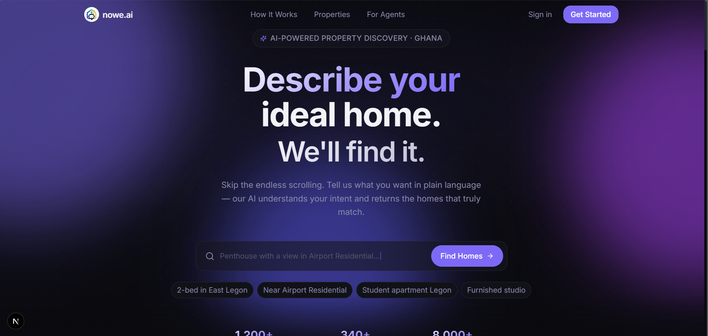

# 🏠 nowe.ai

> **AI-powered property discovery that understands people not just listings.**

## AI for Good Hackathon

**nowe.ai** is an AI-powered property discovery platform built for the **AI for Good Hackathon**. Our mission is to make finding the right home simpler, faster, and more personalized by allowing users to describe what they want in natural language instead of relying on rigid filters.

---

# Project Overview

Finding the right home is about much more than price and location. Every renter has unique lifestyle preferences, daily routines, budget constraints, commuting needs, and personal priorities.

Traditional property search platforms require users to manually combine dozens of filters and browse hundreds of listings before finding a suitable home.

**nowe.ai** changes this experience by using Artificial Intelligence to understand what users actually mean when they describe their ideal home.

Instead of asking users to search using filters alone, they can simply say things like:

> "I need a quiet two-bedroom apartment near public transport with good security and enough space to work from home."

Our AI interprets the request, understands the user's intent, and recommends the most suitable properties.

Although our MVP focuses on renters, the same AI-powered search engine can be extended to support home buyers, commercial property seekers, and real estate professionals.

---

# Problem Statement

Finding suitable housing remains a frustrating and time-consuming process for millions of renters.

Most existing property platforms rely on basic filters such as:

* Price
* Number of bedrooms
* Location
* Property type

These filters cannot understand the lifestyle needs behind a user's search.

As a result, renters often spend hours scrolling through listings that technically match their search but fail to meet their actual requirements.

This affects:

* Renters searching for suitable accommodation
* Students relocating for school
* Young professionals moving to new cities
* Families with specific lifestyle requirements

If this problem remains unsolved:

* Users waste significant time searching.
* Good properties remain undiscovered.
* Decision fatigue increases.
* Property discovery becomes inefficient and frustrating.

---

# 💡 Proposed Solution

**nowe.ai** is an AI-powered property search platform that enables users to search for homes using natural language.

Instead of manually selecting dozens of filters, users simply describe what they are looking for in everyday language.

The platform then:

* Understands the user's intent
* Interprets lifestyle preferences
* Searches available properties
* Recommends the best matches
* Provides conversational assistance through an AI chatbot

This creates a faster, more intuitive, and more personalized property discovery experience.

### What makes nowe.ai different?

Unlike traditional listing platforms that only match structured filters, nowe.ai understands contextual preferences such as:

* Quiet neighborhoods
* Work-from-home suitability
* Safety considerations
* Lifestyle preferences
* Commute convenience
* Furnished vs. unfurnished options
* Personalized recommendations based on user intent

---

# How AI Is Used

Artificial Intelligence is at the core of nowe.ai rather than being an additional feature.

Our MVP uses a **Local Large Language Model (LLM)** to understand natural language queries and generate intelligent property recommendations.

### AI Features Implemented

* ✅ Natural language property search
* ✅ AI chatbot assistant
* ✅ Personalized property recommendations
* ✅ Top 5 property matches based on user preferences

The AI performs several tasks:

* Understands conversational user input
* Extracts meaningful search intent
* Interprets lifestyle preferences
* Matches user intent against available property data
* Recommends the most relevant listings
* Answers user questions conversationally

Using AI eliminates the need for users to translate their needs into rigid search filters, making the experience significantly more natural and efficient.

---

# 🚀 Current Features

* User authentication
* AI-powered natural language search
* Conversational AI assistant
* Personalized property recommendations
* Top 5 intelligent property matches
* Property listings
* Advanced property management
* Property details pages
* Property amenities
* Neighborhood information
* Safety scores
* Commute information
* Responsive user interface

---

# 🔮 Planned Features

* AI-generated property descriptions
* Fraud and scam detection
* Property image analysis
* AI property valuation
* Market trend prediction
* Buyer-focused AI recommendations
* Commercial property support
* Agent dashboards
* Smart notifications

---

# 🛠 Tech Stack

## Frontend

* Next.js
* React
* TypeScript
* Tailwind CSS

## Backend

* Supabase

## Database

* PostgreSQL (Supabase)

## Authentication

* Supabase Auth

## Artificial Intelligence

* Local Large Language Model (LLM)

## Deployment

* Vercel

---

# 💼 Sustainability & Business Potential

nowe.ai is designed with long-term sustainability in mind.

Potential revenue opportunities include:

* Premium property listings
* Subscription plans for landlords
* Subscription plans for estate agents
* AI-powered analytics for property managers
* Commission from successful property matches
* SaaS tools for real estate businesses
* Sponsored listings
* Advertising partnerships
* Enterprise licensing of the AI recommendation engine

This creates multiple pathways for commercialization while continuing to improve housing accessibility and discovery.

---

# 📂 Project Structure

```
nowe.ai/
│
├── README.md
├── src/
├── assets/
├── data/
├── public/
├── supabase/
├── components/
├── app/
├── lib/
├── requirements.txt
└── demo/
```

---

# ⚙️ Installation & Setup

Clone the repository:

```bash
git clone <repository-url>
```

Navigate into the project:

```bash
cd nowe.ai
```

Install dependencies:

```bash
npm install
```

Create a `.env.local` file and configure the required environment variables:

```env
NEXT_PUBLIC_SUPABASE_URL=your_supabase_project_url
NEXT_PUBLIC_SUPABASE_ANON_KEY=your_supabase_anon_key


Run the development server:

```bash
npm run dev
```

Open:

```
http://localhost:3000
```

---

# 🎯 AI for Good Impact

Housing is one of the most important decisions people make, yet property discovery remains inefficient for many renters.

By allowing users to communicate naturally and receive intelligent recommendations, nowe.ai reduces the time, frustration, and complexity involved in finding suitable housing.

The platform demonstrates how AI can improve everyday decision-making while creating a more accessible and user-centered property search experience.

---

# 👥 Team

- Agyemang Edwin Osei
- Nana Adu-Twum
- Williams Opoku Antwi
- Jennifer Owusuwaa Prempeh

---

# 📸 Screenshots



---

# 📄 License

This project was developed for the **AI for Good Hackathon** hosted by **Future Tech Kid**.
